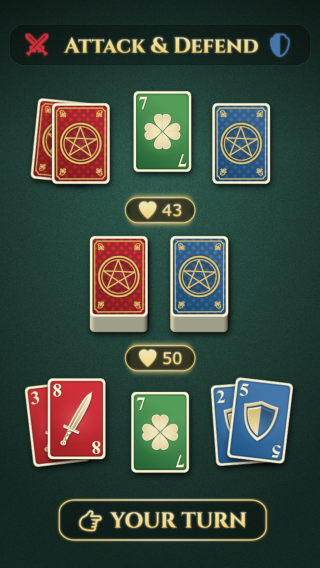

# Grimhand Tactics

1. [Player Quick Reference](#️-player-quick-reference-️)
2. [Game Rules](#️-game-rules-️)

## *Triskai-deka-phobia HD remake*.

This game is a remake of my [js13k2024 Triskai-deka-phobia](https://github.com/romualdk/js13k-2024) entry.

## ⚔️ Player Quick Reference 🛡️

**Objective:** Be the last player with HP (Start: 50 HP).

### 🔄 On Your Turn (Choose 1)

1. **Draw:** Take 1 card from the **Attack** or **Defense** deck.
* *Max Hand:* 13 cards per hand. If you exceed 13, that hand is **flushed**.

2. **Attack:** Use all your Attack cards against the opponent's Defense cards.

### 💥 Damage Calculation

Damage is the **Sum of Values**, not the number of cards:

$$\text{Total Attack Value} - \text{Total Defense Value} = \text{HP Lost}$$

* *Note: If Defense is higher than Attack, damage is 0.*
* *After an attack, all used Attack and Defense cards are discarded.*

### 🃏 Special Cards

* **☘️ Lucky Card (7):** Stored in your Lucky Slot. It is your only protection against the Death Card.
* **☠️ Death Card (13):**
* **With Shamrock:** Both cards are discarded. You survive.
* **Without Shamrock:** **INSTANT DEATH.** Game over.

#### 🏆 Winning

* Reduce opponent to **0 HP**.
* Opponent draws a **Death Card** without a **Shamrock**.

## ⚔️ Game Rules 🛡️

### 🎯 Goal of the Game

**Be the last player standing!**
Each player starts with **50 Health Points (HP)**. Use attack and defense cards strategically to reduce your opponent's HP to zero—or survive long enough for them to draw a fatal card.

### 🃏 The Decks

There are two separate decks of cards. Do not mix them.

* **Attack Deck (Red – Swords):** Used to deal damage.
* **Defense Deck (Blue – Shields):** Used to block incoming attacks.

**Card Composition:**
Each deck contains cards numbered **1–13**.

* **1–12:** Standard Value Cards.
* **13 (Purple Skull):** The **Death Card**.
* **7 (Green Shamrock):** The **Lucky Card**.

### 💚 The Game Board Layout

Play takes place on a green casino-style board with specific zones:

1. **Draw Decks:** Center of the board (Attack and Defense decks, face down).
2. **Hand Cards:** Player's hand at the bottom; Opponent's hand at the top.
3. **Lucky Card Slot:** A specific slot to the right of each player’s hand to store drawn Shamrock cards.
4. **Discard Piles:** Next to each deck for flushed or spent cards.

### 🔄 Turn Sequence

Players take turns. On your turn, you must choose **ONE** of the following actions:

#### Action A: Draw a Card

Draw one card from either the Attack Deck or Defense Deck.

**1. Standard Draw Rules:**

* The card goes into your hand.
* **Hand Limit:** You may hold a maximum of **13 cards** per type (attack or defense).
* **Overfill Penalty:** If a hand exceeds 13 cards, the **entire hand** is flushed (discarded) immediately.

**2. ⚠️ The Death Card Mechanic:**
If you draw the **Death Card (13)**, the following occurs immediately:

* **If you have a Lucky Card (Shamrock) in your slot:**
* You survive.
* The **Death Card** and the **Shamrock** are both placed in their respective discard piles.
* The turn ends.

* **If you DO NOT have a Lucky Card:**
* **Instant Death.** You lose the game immediately.

#### Action B: Attack Opponent

You may choose to attack if you have at least one attack card.

**1. Damage Calculation:**
Damage is calculated using the **sum of the card values**, not the quantity of cards.

$$Damage = \sum(\text{Your Attack Card Values}) - \sum(\text{Opponent's Defense Card Values})$$

* *Example:*
* Attacker plays cards **3** and **7**  Total Attack: **10**
* Defender has card **4**  Total Defense: **4**
* **Result:**  Damage.

**2. Resolution:**

* **Apply Damage:** The Opponent loses HP equal to the final damage value.
* **Negative Damage:** If Defense > Attack, damage dealt is **0** (no healing occurs).
* **Flush Cards:** After the attack is resolved, **ALL** attack cards used by the player and **ALL** defense cards held by the opponent are discarded.

### 🍀 Special Cards Legend

| Card Value | Name | Icon | Effect |
| --- | --- | --- | --- |
| **7** | **Lucky Card** | ☘️ | **Protection:** When drawn, place in the "Lucky Card Slot." It sits passively until needed to negate a Death Card. |
| **13** | **Death Card** | ☠️ | **Instant Kill:** If drawn without a Lucky Card in reserve, the player dies instantly and the game ends. |

### ♻️ Refreshing Decks

If a draw deck runs out of cards:

1. Shuffle the corresponding discard pile.
2. Place them face down to form the new draw deck.

## 🏆 Winning the Game

The game ends when one of the following conditions is met:

1. **HP Elimination:** A player's HP reaches **0**.
2. **Sudden Death:** A player draws a **Death Card** and has no **Lucky Card** to protect them.

The surviving player is the winner!

# 💡 Design

## 🎮 High‑Level Analysis
### 👍 What Already Works Well
- Clear fantasy identity (pentagrams, swords, clovers, dark palette).
- Simple, readable rules — easy onboarding.
- Risk–reward tension with the Death Card mechanic.
- Attack/Defense dual‑deck system gives strategic choice each turn.
- Lucky slot is a clever single‑item inventory that adds drama.
These are strong pillars. Now let’s elevate the experience.

### 📱 What Modern Mobile Games Expect — and How Your Game Can Match It
1. Visual Polish & UX Flow
Your current UI is functional but feels “prototype‑like.” To reach a professional level:
Add
- Card animations (draw, flip, attack impact, shield block).
- Damage pop‑ups with color coding (red for damage, blue for block).
- Turn indicator animation instead of a static button.
- Particle effects for special cards (glow on Lucky 7, ominous pulse on Death 13).
- Health bar animation instead of static numbers.
Remove / Improve
- Flat card backs — add rarity shine, texture, or subtle motion.
- Static backgrounds — consider animated fog, embers, or arcane runes.

2. Game Pacing & Player Engagement
Right now, the loop is very binary: draw or attack. Modern players expect more micro‑decisions.
Consider Adding
- Card abilities (e.g., “Double next attack,” “Steal 1 defense,” “Peek top card”).
- Combo bonuses (e.g., playing two swords in a row gives +2).
- Energy system (1–3 energy per turn, cards cost energy).
- Hand management pressure (discard 1 card per turn if hand is full).
Consider Removing
- The 13‑card flush might feel punishing. Modern players dislike losing progress unexpectedly.
Instead:
- Replace with “Overdraw penalty: lose 3 HP”
- Or “Forced discard: remove lowest‑value card”

3. Meta‑Game Progression
This is where mobile games thrive. You need long‑term goals.
Add
- Card upgrades (increase value, add effects).
- Deck customization (choose starting cards or passives).
- Daily quests (win 3 matches, block 20 damage, etc.).
- Unlockable card skins (cosmetic monetization).
- Player level system with rewards.
Remove
- Anything that makes every match feel identical.
Add variety through:
- Random events
- Different enemy archetypes
- Boss fights with unique rules

4. Modern Monetization (Fair & Optional)
Players accept monetization if it feels cosmetic or time‑saving.
Safe Options
- Cosmetic card backs.
- Premium animations.
- Battle pass with skins and currency.
- Optional “starter bundle” with unique visuals.
Avoid
- Selling power directly (pay‑to‑win kills retention).

5. Clarity of Mechanics
Your rules are good, but the UI should reinforce them.
Add
- Tooltips when tapping a card.
- Preview damage before confirming an attack.
- Lucky slot indicator that glows when filled.
- Death Card warning when the deck is low.
Remove
- Hidden math. Players love transparency.

6. Audio & Feedback
Even simple sound design elevates the experience.
Add
- Draw sound (soft shuffle).
- Attack sound (metal clash).
- Defense sound (shield impact).
- Lucky 7 chime.
- Death Card sting (deep bass hit).

### 🧠 Game Design Suggestions to Deepen Strategy
Add New Card Types
- Hex Card: Reduces opponent’s next draw value by 2.
- Blessing Card: Heals 3–5 HP.
- Mirror Shield: Reflects part of the next attack.
- Gamble Card: Draw 2, discard 1 at random.
Add Status Effects
- Bleed: Opponent loses 2 HP for 3 turns.
- Fortify: +3 defense next turn.
- Expose: Opponent’s next defense is halved.
These create richer decision‑making without overwhelming players.

### 🧩 Presentation of the Death Card Mechanic
This is your signature feature — lean into it.
Add
- Dramatic animation when drawn.
- Screen shake.
- Slow‑motion reveal.
- Unique sound cue.
- “Fate meter” showing the chance of drawing it soon.
This turns a simple rule into a memorable moment.

### 🏁 Summary: What to Add / Remove
Add
- Animations, effects, sound design.
- Card abilities and combos.
- Meta progression (levels, upgrades, cosmetics).
- Tooltips, previews, and clearer UI.
- More card variety and status effects.
- Dramatic presentation for special cards.
Remove / Rework
- Harsh hand‑flush mechanic.
- Static UI elements.
- Repetitive match flow.
- Lack of long‑term goals.

## 🃏 Card ideas

### ⚔️ New Attack‑Focused Cards
1. Berserker Blade (Value 6–9)
Effect: If your total Attack is lower than the opponent’s Defense, this card doubles its value.
Purpose: Helps comeback plays and reduces “wasted” attacks.

2. Piercing Strike (Value 4–7)
Effect: Ignores half of the opponent’s Defense value.
Purpose: Introduces armor‑breaking without adding new math layers.

3. Chain Slash (Value 3–5)
Effect: For every other Attack card played this turn, add +1.
Purpose: Rewards aggressive, multi‑card attacks.

### 🛡️ New Defense‑Focused Cards
4. Iron Wall (Value 6–10)
Effect: After blocking, retain half its value for your next turn.
Purpose: Creates a “carryover shield” that encourages defensive builds.

5. Counter Shield (Value 5–8)
Effect: If it fully blocks the attack (0 damage), deal 2 damage back.
Purpose: Adds a light counter‑attack mechanic without complicating combat.

6. Mist Barrier (Value 4–6)
Effect: Opponent’s next Attack card drawn has –2 value.
Purpose: Soft debuff that affects future turns, not just the current one.

🍀 New Luck / Special Cards
7. Double Shamrock (Value 7)
Effect:
- Counts as a Lucky Card
- AND gives +3 HP when drawn
Purpose: A rare, exciting pull that feels rewarding.

8. Fate Twist (Value 0)
Effect:
Swap the top card of the Attack and Defense decks.
Purpose: Light deck manipulation without revealing too much.

9. Fortune Surge (Value 0)
Effect:
Draw 2 cards. Then discard 1 card of your choice.
Purpose: Controlled cycling to fix bad hands.

### ☠️ Risk / Gamble Cards
10. Blood Pact (Value 10)
Effect:
Add +10 to your next attack, but lose 5 HP immediately.
Purpose: High‑risk, high‑reward play for aggressive players.

11. Cursed Steel (Value 8)
Effect:
If used in an attack that deals 0 damage, take 3 damage yourself.
Purpose: Encourages smart timing and discourages blind attacks.

12. Doom Token (Value 0)
Effect:
Place on opponent. Their next Lucky Card is disabled.
Purpose: A soft counter to the Lucky 7 mechanic without being unfair.

🔮 Utility / Control Cards
13. Scrying Orb (Value 0)
Effect:
Look at the top 3 cards of any deck. Put them back in any order.
Purpose: Adds tactical foresight and planning.

14. Swap Hands (Value 0)
Effect:
Both players choose 1 card from their hand and swap them.
Purpose: Creates mind‑games and interaction.

15. Purge (Value 0)
Effect:
Discard any 1 card from your hand. Draw 1 new card.
Purpose: Simple hand‑fixing tool that reduces frustration.

### 🧩 Status‑Effect Cards (Optional Layer)
If you want to introduce light status effects without turning the game into a full RPG:
16. Bleeding Edge (Value 5)
Effect:
Opponent loses 2 HP for the next 2 turns.
Purpose: Adds pressure over time.

17. Guardian Rune (Value 4)
Effect:
Your next Defense card gets +3 value.
Purpose: Buffs without clutter.

18. Hex of Weakness (Value 0)
Effect:
Opponent’s next Attack has –3 value.
Purpose: A clean, easy debuff.

### 🏆 What These Cards Add to Your Game
- More strategic depth
- More varied playstyles (aggressive, defensive, control, luck‑based)
- More dramatic moments
- More modern mobile‑game feel
- More opportunities for progression and rarity tiers
